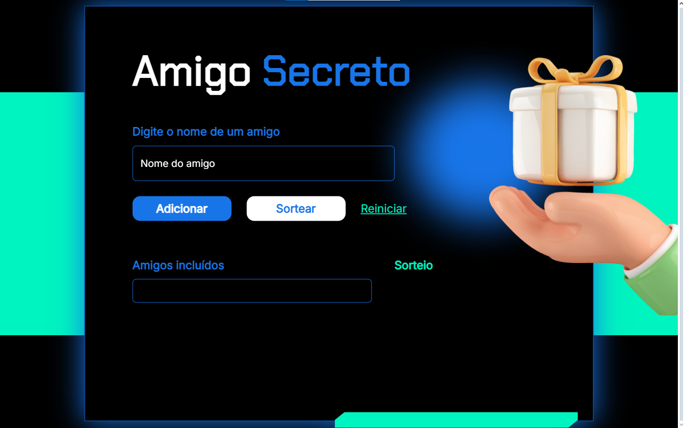

# Sorteador de Amigos Secreto

Este projeto é um sorteador de amigos secreto desenvolvido em JavaScript, utilizando o algoritmo Fisher-Yates para embaralhar os participantes de forma justa e aleatória. O usuário pode adicionar os nomes dos participantes, realizar o sorteio e visualizar os pares gerados. Ideal para organizar sorteios de amigos secretos de maneira prática e rápida.

## Demonstração

## Funcionalidades

- Adição de nomes dos participantes.
- Embaralhamento dos nomes utilizando o algoritmo Fisher-Yates.
- Geração de pares de amigos secretos de forma aleatória.
- Exibição dos resultados na tela.
- Possibilidade de reiniciar o sorteio e adicionar novos participantes.

## Tecnologias Utilizadas

- **HTML5**: Estrutura do conteúdo da página.
- **CSS3**: Estilização da interface para uma experiência visual agradável.
- **JavaScript**: Lógica para controle do sorteio e exibição dos resultados.

## Como executar o projeto

1. Clone o repositório para sua máquina local:

    git clone https://github.com/Leandro-Rocha81/Sorteador-de-Amigo-Secreto.git

2. Abra o arquivo https://sorteador-de-amigo-secreto-sand.vercel.app no navegador para visualizar o projeto.
3. Adicione os nomes dos participantes, clique em "Sortear" e veja os resultados.
4. Use a função "Reiniciar" para começar um novo sorteio.

## Melhorias Futuras

- Implementar uma funcionalidade para salvar o sorteio gerado.
- Adicionar a possibilidade de enviar os pares de amigos secretos por e-mail.
- Incluir uma funcionalidade para impedir que a mesma pessoa tire ela mesma no sorteio.

## Contribuição

Contribuições são bem-vindas! Sinta-se à vontade para abrir uma *issue*, enviar um *pull request* com melhorias ou relatar problemas no repositório.

## Contato

Desenvolvido por Leandro Vitor Santos Rocha. Entre em contato em leandrocomercial81@gmail.com.
